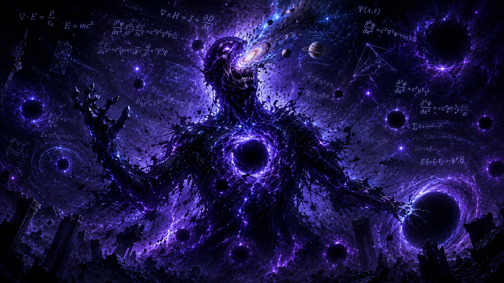
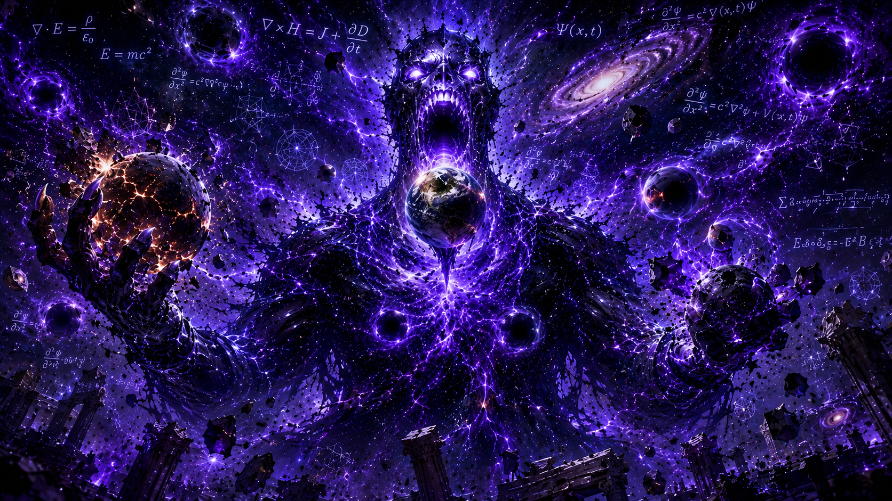
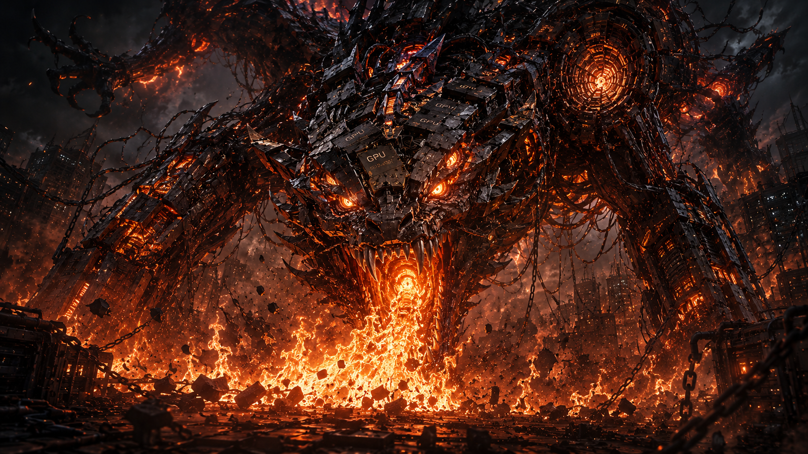
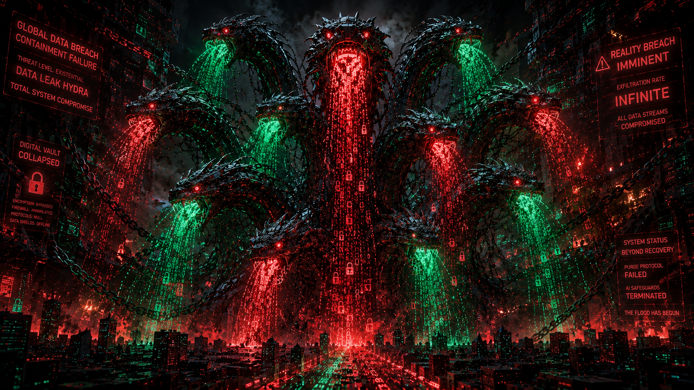
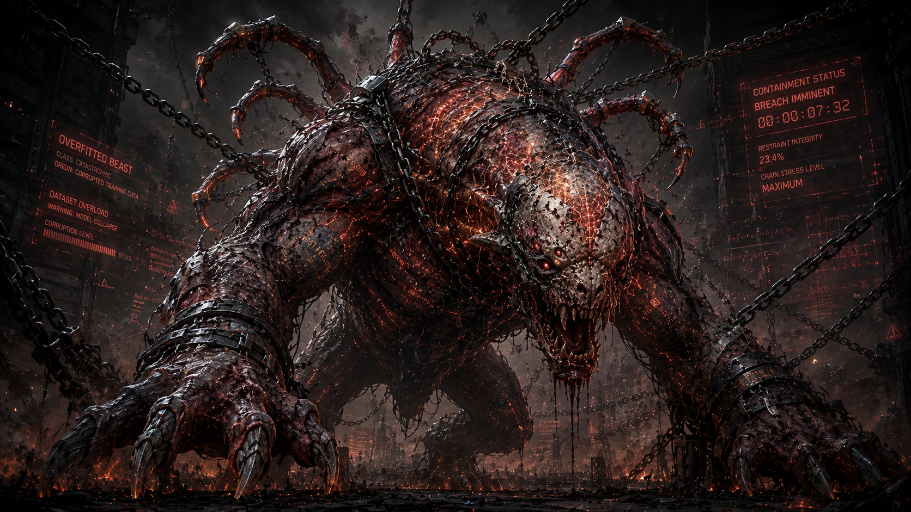
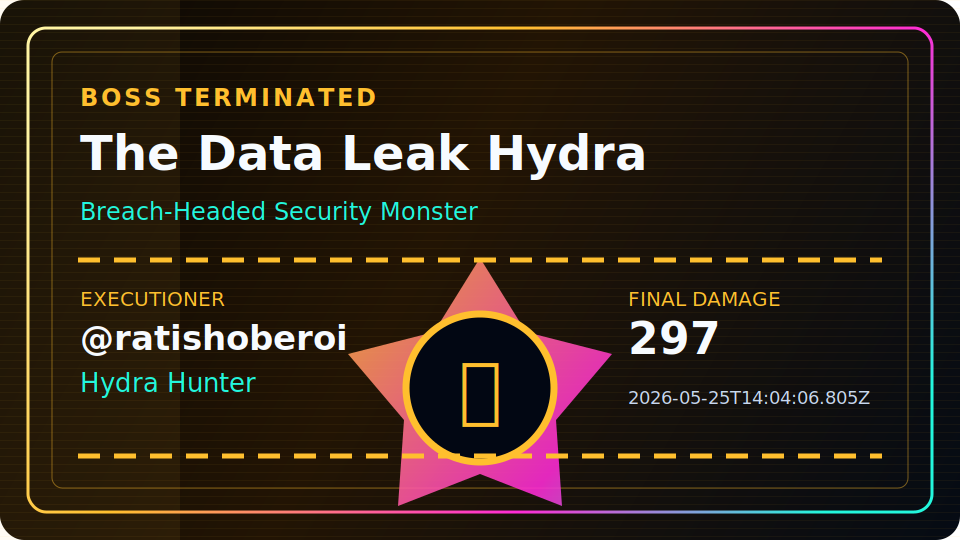

<div align="center">

# RATISH OBEROI

### EX-CTO • AI/ML ENGINEER • SYSTEM BUILDER

**Raised ₹1 Cr+ Pre-Seed Funding**

Building AI systems, LLM infrastructure, developer platforms, and intelligent automation.

```
AI SYSTEMS................................................[ ACTIVE ]
LLM INFRASTRUCTURE........................................[ BUILDING ]
AUTOMATION PLATFORMS......................................[ SHIPPING ]
PROFILE RAID..............................................[ LIVE ]
```

</div>

## Visitor Intro

This is not a traditional GitHub profile.

You are entering a live AI portfolio and interactive world boss raid. Fight bosses, earn loot, climb the leaderboard, and explore the systems, products, and AI engineering work behind the profile.

## About Me

I build AI systems, intelligent developer tools, automation platforms, and production-grade software from concept to deployment.

I am an **Ex-CTO**, **AI/ML Engineer**, **Full Stack Engineer**, and **System Builder** with experience raising **₹1 Cr+ in Pre-Seed funding** and building technical products end to end.

Current focus areas:

- Artificial Intelligence and Machine Learning systems
- LLM systems, RAG pipelines, and retrieval infrastructure
- Deep Learning, Computer Vision, and NLP
- AI infrastructure, automation systems, and developer platforms
- Full stack product engineering from architecture to deployment

# 🔥 GLOBAL RAID ACTIVE

## Current Boss

<p align="center">
  
</p>

## THE GRADIENT VANISHER

### Fading Backprop Phantom

**HP 559 / 1500 (37%)**  
`█████████░░░░░░░░░░░░░░░`

**Phase 3 of 4**  
Corrupted form: transparent fractures erase pieces of its torso and face.

<p align="center">
  <strong>⬇⬇⬇ RAIDERS, STRIKE NOW ⬇⬇⬇</strong>
</p>

<h1 align="center">
  <a href="https://github.com/ratishoberoi/ratishoberoi/issues/new?template=attack.yml">⚔ ATTACK THIS BOSS ⚔</a>
</h1>

<p align="center">
  <strong>⬆⬆⬆ CLICK TO ROLL DAMAGE + CLAIM LOOT ⬆⬆⬆</strong>
</p>

Takes 10 seconds. Roll damage. Claim loot. Maybe land the killing blow.

## Raid Rules

### Attack Damage

| Attack | Damage |
| --- | ---: |
| Slash | 5-20 |
| Critical Strike | 0-100 |
| Lucky Attack | 1-500 |

### Drop Rates

| Rarity | Drop Rate | Owned | Registry Items |
| --- | ---: | ---: | ---: |
| Common | 80% | 12 | 4 |
| Rare | 15% | 9 | 4 |
| Epic | 4% | 0 | 4 |
| Legendary | 0.9% | 0 | 4 |
| Mythic | 0.1% | 0 | 3 |

Every attack is processed by GitHub Actions. Damage is applied to the shared boss, loot rolls automatically, the README updates, and the attack issue closes with the result.

<details>
<summary>Loot Vault</summary>

**Latest Drop:** @SBANTHIA75 found Lost Token (Common)  
**Vault:** 21 relics held by 2 collectors  
**Rare History:** 0 Legendary / 0 Mythic  
**Top Collector:** @ratishoberoi (17 relics)

### Hall of Relics

| Relic Signal | Value |
| --- | ---: |
| Total Relics Held | 21 |
| Active Collectors | 2 |
| Legendary Discoveries | 0 |
| Mythic Discoveries | 0 |

| Rarity | Drop Rate | Owned | Registry Items |
| --- | ---: | ---: | ---: |
| Common | 80% | 12 | 4 |
| Rare | 15% | 9 | 4 |
| Epic | 4% | 0 | 4 |
| Legendary | 0.9% | 0 | 4 |
| Mythic | 0.1% | 0 | 3 |

### Latest Drops

| Time | Collector | Relic | Rarity |
| --- | --- | --- | --- |
| 2026-05-27T11:12:02.759Z | @SBANTHIA75 | Lost Token | Common |
| 2026-05-27T11:11:42.833Z | @SBANTHIA75 | Gradient Crystal | Rare |
| 2026-05-27T11:08:12.751Z | @ratishoberoi | Broken Dataset | Common |
| 2026-05-27T11:04:42.475Z | @SBANTHIA75 | Prompt Shard | Rare |
| 2026-05-27T11:04:15.010Z | @SBANTHIA75 | Corrupted CSV | Common |
| 2026-05-25T17:54:50.759Z | @ratishoberoi | Corrupted CSV | Common |
| 2026-05-25T17:47:44.711Z | @ratishoberoi | Corrupted CSV | Common |
| 2026-05-25T14:34:03.498Z | @ratishoberoi | Neural Fragment | Rare |
| 2026-05-25T14:33:33.169Z | @ratishoberoi | Broken Dataset | Common |
| 2026-05-25T14:04:06.805Z | @ratishoberoi | Corrupted CSV | Common |

### Legendary Discoveries

No legendary relics discovered yet.

### Mythic Discoveries

No mythic relics discovered yet.

### Top Collectors

| Rank | Collector | Total Relics | Unique | Legendary | Mythic |
| ---: | --- | ---: | ---: | ---: | ---: |
| 1 | @ratishoberoi | 17 | 7 | 0 | 0 |
| 2 | @SBANTHIA75 | 4 | 4 | 0 | 0 |

### Recent Loot

| Time | Collector | Drop | Rarity | Damage |
| --- | --- | --- | --- | ---: |
| 2026-05-27T11:12:02.759Z | @SBANTHIA75 | Lost Token | Common | 269 |
| 2026-05-27T11:11:42.833Z | @SBANTHIA75 | Gradient Crystal | Rare | 452 |
| 2026-05-27T11:08:12.751Z | @ratishoberoi | Broken Dataset | Common | 111 |
| 2026-05-27T11:04:42.475Z | @SBANTHIA75 | Prompt Shard | Rare | 6 |
| 2026-05-27T11:04:15.010Z | @SBANTHIA75 | Corrupted CSV | Common | 16 |
| 2026-05-25T17:54:50.759Z | @ratishoberoi | Corrupted CSV | Common | 46 |
| 2026-05-25T17:47:44.711Z | @ratishoberoi | Corrupted CSV | Common | 17 |
| 2026-05-25T14:34:03.498Z | @ratishoberoi | Neural Fragment | Rare | 16 |
| 2026-05-25T14:33:33.169Z | @ratishoberoi | Broken Dataset | Common | 8 |
| 2026-05-25T14:04:06.805Z | @ratishoberoi | Corrupted CSV | Common | 297 |

</details>

## 🏆 TOP RAIDERS

> ### 🥇 #1 Raider
> **@ratishoberoi**
>
> **Total Damage:** 1568  
> **Attacks:** 17

> ### 🥈 #2 Raider
> **@SBANTHIA75**
>
> **Total Damage:** 743  
> **Attacks:** 4

> ### 🥉 #3 Raider
> **Open Slot**
>
> **Total Damage:** 0  
> **Attacks:** 0

### Top 10 Attackers

| Rank | Attacker | Total Damage | Attacks |
| ---: | --- | ---: | ---: |
| 1 | @ratishoberoi | 1568 | 17 |
| 2 | @SBANTHIA75 | 743 | 4 |

### Current Record Holders

**Most Damage:** @ratishoberoi (1568)  
**Most Loot:** @ratishoberoi (17)  
**Most Executions:** @ratishoberoi (2)

## ⚔ RECENT COMBAT

### Last 10 Attacks

| Time | Attacker | Attack | Damage | Result |
| --- | --- | --- | ---: | --- |
| 2026-05-27T11:12:02.759Z | @SBANTHIA75 | Lucky Attack | 269 | Phase 3 |
| 2026-05-27T11:11:42.833Z | @SBANTHIA75 | Lucky Attack | 452 | Phase 2 |
| 2026-05-27T11:08:12.751Z | @ratishoberoi | Lucky Attack | 111 | Phase 1 |
| 2026-05-27T11:04:42.475Z | @SBANTHIA75 | Critical Strike | 6 | Phase 1 |
| 2026-05-27T11:04:15.010Z | @SBANTHIA75 | Slash | 16 | Phase 1 |
| 2026-05-25T17:54:50.759Z | @ratishoberoi | Critical Strike | 46 | Phase 1 |
| 2026-05-25T17:47:44.711Z | @ratishoberoi | Slash | 17 | Phase 1 |
| 2026-05-25T14:34:03.498Z | @ratishoberoi | Slash | 16 | Phase 1 |
| 2026-05-25T14:33:33.169Z | @ratishoberoi | Slash | 8 | Phase 1 |
| 2026-05-25T14:04:06.805Z | @ratishoberoi | Lucky Attack | 297 | Defeated boss |

## Live Pulse

**Last Attack:** @SBANTHIA75 hit for 269  
**Latest Loot:** @SBANTHIA75 found Lost Token (Common)  
**Top Raider:** @ratishoberoi with 1568 damage  
**Boss Killer:** @ratishoberoi (Hydra Hunter)

## Phase Evolution

<table>
  <tr>
    <td align="center" width="25%">
      
      <br><strong>✓ CLEARED</strong><br>
      <sub>Phase 1</sub>
    </td>
    <td align="center" width="25%">
      
      <br><strong>✓ CLEARED</strong><br>
      <sub>Phase 2</sub>
    </td>
    <td align="center" width="25%">
      
      <br><strong>🔥 CURRENT</strong><br>
      <sub>Phase 3</sub>
    </td>
    <td align="center" width="25%">
      
      <br><strong>🔒 LOCKED</strong><br>
      <sub>Phase 4</sub>
    </td>
  </tr>
</table>

**✓ Phase 1 → ✓ Phase 2 → 🔥 Phase 3 → 🔒 Phase 4**  
Current transformation: Corrupted form: transparent fractures erase pieces of its torso and face.  
Phases remaining: **1**

## WORLD BOSS CAMPAIGN

<table>
  <tr>
    <td align="center" width="50%">
      
      <br><strong>☠ EXECUTED</strong><br>
      <strong>Boss 1: The GPU Devourer</strong><br><sub>Executed by:<br>@ratishoberoi<br>Badge:<br>GPU Slayer<br>2026-05-25T07:25:41.744Z</sub>
    </td>
    <td align="center" width="50%">
      
      <br><strong>☠ EXECUTED</strong><br>
      <strong>Boss 2: The Data Leak Hydra</strong><br><sub>Executed by:<br>@ratishoberoi<br>Badge:<br>Hydra Hunter<br>2026-05-25T14:04:06.805Z</sub>
    </td>
  </tr>
  <tr>
    <td align="center" width="50%">
      
      <br><strong>⚔ CURRENT</strong><br>
      <strong>Boss 3: The Gradient Vanisher</strong><br><sub>HP 559 / 1500<br>Phase 3</sub>
    </td>
    <td align="center" width="50%">
      
      <br><strong>🔒 LOCKED</strong><br>
      <strong>Boss 4: The Hallucination Titan</strong><br><sub>LOCKED</sub>
    </td>
  </tr>
  <tr>
    <td align="center" width="50%">
      
      <br><strong>🔒 LOCKED</strong><br>
      <strong>Boss 5: The Overfitted Beast</strong><br><sub>LOCKED</sub>
    </td>
    <td align="center" width="50%">
      
      <br><strong>🔒 LOCKED</strong><br>
      <strong>Boss 6: The Prompt Goblin</strong><br><sub>LOCKED</sub>
    </td>
  </tr>
</table>

## NEXT THREAT

<table>
  <tr>
    <td align="center" width="45%">
      
    </td>
    <td width="55%">
      <strong>The Hallucination Titan</strong><br>
      A towering oracle that speaks in impossible outputs and bends reality around false predictions.<br><br>
      <strong>Unlock Requirement:</strong> Execute The Gradient Vanisher.
    </td>
  </tr>
</table>

## Executioners

<p align="center">
  
</p>

<details>
<summary>Executioner Records</summary>

## 👑 Executioner Hall

| Boss | Executioner | Badge | Final Blow | Date |
| --- | --- | --- | ---: | --- |
| The Data Leak Hydra | @ratishoberoi<br>(Hydra Hunter) | Hydra Hunter | 297 | 2026-05-25T14:04:06.805Z |
| The GPU Devourer | @ratishoberoi<br>(GPU Slayer) | GPU Slayer | 441 | 2026-05-25T07:25:41.744Z |

## Top Executioners

| Executioner | Execution Count | First Execution | Latest Execution |
| --- | ---: | --- | --- |
| @ratishoberoi | 2 | 2026-05-25T07:25:41.744Z | 2026-05-25T14:04:06.805Z |

</details>

## Hall of Fame

<details>
<summary>Defeated Bosses</summary>

### Cinematic Defeat Archive

<table>
  <tr>
    <td align="center" width="55%">
      
    </td>
    <td width="45%">
      <h3>The Data Leak Hydra</h3>
      <strong>Executioner:</strong> @ratishoberoi<br>
      <strong>Badge Earned:</strong> Hydra Hunter<br>
      <strong>Final Blow:</strong> 297<br>
      <strong>Execution Date:</strong> 2026-05-25T14:04:06.805Z
    </td>
  </tr>
</table>

<table>
  <tr>
    <td align="center" width="55%">
      
    </td>
    <td width="45%">
      <h3>The GPU Devourer</h3>
      <strong>Executioner:</strong> @ratishoberoi<br>
      <strong>Badge Earned:</strong> GPU Slayer<br>
      <strong>Final Blow:</strong> 441<br>
      <strong>Execution Date:</strong> 2026-05-25T07:25:41.744Z
    </td>
  </tr>
</table>

</details>

## Key Achievements

- Raised **₹1 Cr+ Pre-Seed funding** for a technology venture.
- Operated as **CTO**, owning product architecture, engineering execution, and technical direction.
- Built AI/ML systems end to end across model development, backend services, automation, and deployment.
- Designed production automation systems using GitHub Actions, stateful workflows, and generated interfaces.
- Built a GitHub-native raid platform with dynamic README rendering, stateful gameplay, execution history, and campaign progression.

## Featured Projects

### FORGE

**Flagship project: multi-model AI engineering platform.**

Forge focuses on multi-model orchestration, AI coding workflows, model routing, agentic execution, and LLM infrastructure for serious engineering work.

### REPOMIND AI

**AI-powered repository intelligence platform.**

RepoMind AI is designed for codebase understanding, repository analysis, AI search, developer productivity, and knowledge extraction from complex software systems.

### VERITAS RAG

**Production-grade Retrieval-Augmented Generation system.**

Veritas RAG focuses on RAG pipelines, document intelligence, semantic retrieval, vector search, and grounded knowledge generation.

### GITHUB BOSS RAID

**Interactive GitHub-native world boss campaign.**

GitHub Boss Raid uses GitHub Actions, issue forms, stateful gameplay, dynamic README generation, loot, executioners, and campaign progression entirely inside GitHub.

## Tech Stack

### Languages


### AI / ML


### LLM / RAG


### Backend


### Frontend


### Databases


### DevOps / Infrastructure


## GitHub Stats

<div align="center">


</div>

## Contact

<div align="center">

[](https://www.linkedin.com/in/ratishoberoi)
[](https://leetcode.com/u/ratishoberoi/)
[](mailto:ratishoberoi3993@gmail.com)

</div>

<!-- This README is generated by scripts/render_readme.js. -->
